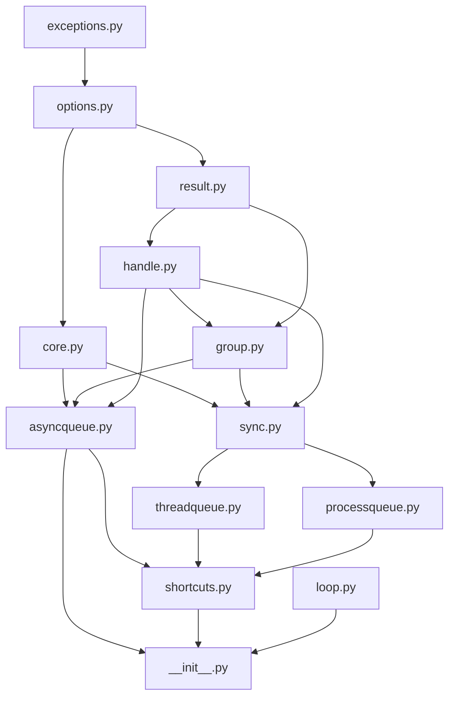

# Codebase Walkthrough

This is the onboarding guide for developers working **on** osiiso (as opposed
to *with* it).  It explains every module, class, method, constant, and state
variable in the library, how they connect, and the invariants that keep the
whole thing correct.  Read it top to bottom once; afterwards each section
works as a reference.

The library is ~2,700 lines across 13 modules in `src/osiiso/`.  Nothing here
is generated — every line is hand-written and intended to be read.

---

## 1. The mental model

osiiso is one queue API implemented on three execution backends:

| Queue | Executes work on | Use case |
|---|---|---|
| `AsyncQueue` | coroutines on one asyncio event loop | async I/O |
| `ThreadQueue` | worker threads | blocking I/O, sync SDKs |
| `ProcessQueue` | a pool of persistent subprocesses | CPU-bound work |

Everything in the library hangs off five nouns:

- **Task** — one unit of work: a callable + args + options.  Internally a
  `_Task` record; never exposed to users.
- **Handle** — the user's view of one submitted task (`TaskHandle` /
  `SyncTaskHandle`).  Await it, block on it, cancel it, attach callbacks.
- **Options** — an immutable `TaskOptions` bundle (priority, retries,
  timeout, scheduling, …) resolved once at submit time.
- **Result** — an immutable `TaskResult` produced exactly once per task, plus
  the aggregate `RunSummary` produced per `run()`.
- **Queue** — the machine that turns submitted tasks into results: workers,
  a priority queue, a scheduler for delayed tasks, a retry engine, a rate
  gate, and lifecycle management (start / run / shutdown / reset).

The core design decision: **all control-plane logic is shared**.  There is
one submission plane (`core._SubmitPlane`), one sync engine
(`sync._SyncQueue`) that both `ThreadQueue` and `ProcessQueue` plug into, and
one async engine (`AsyncQueue`) that mirrors the sync engine's structure
method-for-method.  A backend only answers one question: *"how do I execute a
single attempt of a single task, and how do I interrupt it?"*

### Module dependency graph



Arrows point from dependency to dependent.  The layering is strict: leaf
modules (`exceptions`, `options`, `result`, `handle`) know nothing about
queues; `core` knows about options and handles but not about any concrete
queue; the three queues know about everything below them; `shortcuts` and
`__init__` sit on top.

### Life of a task (the 60-second version)

1. `q.submit(fn, *args, retries=2)` → `resolve_opts` merges the keyword
   overrides into a `TaskOptions` → `_enqueue` builds a `_Task` (with a fresh
   handle), increments the **outstanding counter**, and either puts the task
   on the **ready priority queue** or, if it has a `delay`/`run_at`, hands it
   to the **scheduler** (a loop timer or the timer thread).
2. A **worker** (coroutine or thread) pulls the task off the ready queue and
   runs the **attempt loop** (`_attempts`): rate-gate → run one attempt →
   on exception, maybe retry with backoff → produce exactly one outcome.
3. The outcome goes through **`_record`**: the handle is resolved (waking
   awaiters, firing done-callbacks), the `TaskResult` is appended, the
   outstanding counter is decremented, and — at zero — the **idle signal**
   fires.
4. `await q.run()` / `q.run()` is, at heart, "wait for the idle signal (with
   an optional timeout), then stop the workers and slice the results
   collected during this run into a `RunSummary`."

Keep two invariants in mind while reading everything below; the entire
design is built on them:

!!! important "Invariant 1 — every task lives in exactly one place"
    At any instant a not-yet-finished task is in **exactly one** container:
    `dormant` (async, scheduled before the loop exists), `_timers` (async,
    armed on a loop timer), `_later` (sync scheduled heap), `_ready` (the
    priority queue), or `_runners`/`_active` (currently executing).  Every
    cancellation path knows this and searches the containers in order.

!!! important "Invariant 2 — every task is recorded exactly once"
    Every task ends in exactly one `_record(handle, result)` call.
    `_record` is guarded by `handle._mark_finished()` returning `False` on a
    second call, so even if two code paths race to finish the same task
    (e.g. a cancel racing a completion), the outstanding counter is
    decremented exactly once.  If you ever add a new completion path, it
    **must** go through `_record`.

---

## 2. `exceptions.py` — the error hierarchy

Four exceptions, one root:

```
OsiisoError (Exception)
├── ClosedError       submit()/map()/group() on a closed or halting queue
├── QueueFullError    AsyncQueue.submit() when `size` outstanding tasks exist
└── ExecutionError    tasks failed (or were cancelled) during execution
```

`ExecutionError.__init__(results)` stores the offending `TaskResult`s as a
tuple on `self.results` and builds its message by **counting statuses**:
results with `status == "failed"` count as failed, everything else as
cancelled — producing `"2 task(s) failed; 1 task(s) cancelled"`.  An empty
list yields the fallback `"0 task(s) failed"`.

It is raised from three places: `RunSummary.raise_for_errors()` (which
`run(strict=True)` calls), `group.values()` (which passes
`include_cancelled=True`), and therefore also the `amap`/`tmap`/`pmap`
shortcuts.

`ClosedError` and `QueueFullError` are raised only from `_enqueue`
implementations.  Note the asymmetry: a *bounded sync queue blocks* instead
of raising `QueueFullError`, because a thread can wait; a coroutine calling
the synchronous `submit()` cannot.

---

## 3. `options.py` — `TaskOptions`

`TaskOptions` is a `@dataclass(frozen=True, slots=True)` — immutable and
compact.  Immutability matters: one options object is shared by every task
in a `map()`/`group()` call, and the `_Task` dataclass uses a single shared
default instance, so nothing may ever mutate one.

### Fields

| Field | Default | Consumed by |
|---|---|---|
| `priority` | `3` | `_Task` ordering (lower runs first) |
| `must_complete` | `False` | every cancellation decision (see §12) |
| `timeout` | `None` | per-**attempt** limit in `_attempts`/`_execute` |
| `retries` | `0` | attempt loop: total attempts = `1 + retries` |
| `retry_delay` | `0.0` | sleep before first retry |
| `backoff` | `1.0` | multiplier applied to the delay after each retry |
| `delay` | `None` | scheduler: run this many seconds from submit |
| `run_at` | `None` | scheduler: run at this `time.time()` timestamp |
| `name` | `None` | overrides the auto-derived callable name |
| `group_id` | `None` | stamped on handle/result; set by `group()` |
| `detached` | `False` | result excluded from the `RunSummary` |
| `metadata` | `None` | opaque user data copied to handle and result |

`__post_init__` validates: `timeout > 0`, `retries >= 0`, `retry_delay >= 0`,
`backoff > 0`, `delay >= 0`, and `delay`/`run_at` mutual exclusion.  Because
`replace()` uses `dataclasses.replace`, validation re-runs on every copy —
you cannot build an invalid options object through any path.

### Module-level helpers

- `OPTION_FIELDS: frozenset[str]` — the set of field names, computed once
  from `dataclasses.fields`.  Used to reject typos in submit kwargs.
- `_DEFAULT = TaskOptions()` — a shared default instance so the hot path
  (`submit` with no options) allocates nothing.
- `resolve_opts(opts, overrides)` — the single merge function used by every
  submission API.  Rules: unknown override keys → `TypeError`; no overrides →
  return `opts` (or `_DEFAULT`); overrides with no base → construct fresh;
  both → `dataclasses.replace(opts, **overrides)` (overrides win).

---

## 4. `result.py` — `TaskResult`, `RunSummary`, `make_result`

### `TaskResult`

A frozen slots dataclass — the permanent record of one finished task.
`task_id`, `name`, `status` (the `TaskStatus` literal:
`"succeeded" | "failed" | "cancelled"`), `value`, `exception`, `attempts`,
plus a copy of the handle's metadata fields (`priority`, `must_complete`,
`group_id`, `detached`, `scheduled_for`, `metadata`) and timing
(`created_at`, `started_at`, `finished_at`, `duration`, all
`time.perf_counter()` based).  `message` is a short human string
(`"cancelled before execution"`, the stringified exception, …).

`started_at is None` means the task never began (cancelled while queued), in
which case `duration` is `0.0`.

### `make_result(handle, status, *, value, exception, message)`

The only factory for `TaskResult`s.  It snapshots `time.perf_counter()` as
`finished_at`, reads the private `handle._started_at`, and copies every
metadata field off the handle.  All queue code calls this — never construct
a `TaskResult` by hand inside engine code, or you will miss a field.

### `RunSummary`

The aggregate for one `run()` (or one `group.wait()`).  Stored fields:
`total_submitted`, `succeeded`, `failed`, `cancelled`, `timed_out`,
`duration`, `results` (ordered tuple).

Derived accessors — all trivial filters over `results`:

- properties `errors` (failed), `values` (succeeded values, result order),
  `ok` (`failed == cancelled == 0 and not timed_out`);
- methods `successes()`, `cancellations()`, `by_task_id()`, `by_name()`,
  `by_group()` (the latter two use `defaultdict(list)` then freeze to
  tuples);
- `raise_for_errors(include_cancelled=False)` — raises `ExecutionError` with
  the failed (and optionally cancelled) results;
- `display()` — a formatted stdout report used by examples;
- `from_results(results, *, run_start, timed_out)` — the classmethod factory
  every producer uses; it `Counter`s the statuses and computes `duration`
  from `run_start`.

**Detached tasks never reach a `RunSummary`**: the queues filter
`r.detached` out of the window before calling `from_results` (see the `run()`
walkthroughs below).  They still appear in `queue.results`.

---

## 5. `handle.py` — the two handle flavours

Handles are the concurrency-sensitive heart of the library: they are written
by worker threads/coroutines and read by arbitrary user threads.  The design
is a **template method** pattern: `_BaseHandle` owns all state and the
finish protocol; subclasses only customise *how waiters are woken*.

### `_BaseHandle`

Slots (public attributes are set once at construction and never mutated):
`task_id`, `name`, `priority`, `must_complete`, `created_at`, `group_id`,
`detached`, `scheduled_for`, `metadata` — plus private state `_attempts`,
`_cancel_fn`, `_lock` (a `threading.Lock`), `_result` (starts `None`),
`_status`, `_started_at`, `_callbacks` (lazily-created list).

Two class attributes let subclasses pick ecosystem-appropriate exceptions:

- `_pending_error` — raised by `result()`/`exception()` before completion.
  `RuntimeError` for sync, `asyncio.InvalidStateError` for async.
- `_cancelled_error` — raised by `value()` for a cancelled task.
  `asyncio.CancelledError` for async, `concurrent.futures.CancelledError`
  for sync.  (On some builds these are distinct classes, which is why it is
  configurable at all.)

Reader methods:

- `status` / `attempts` — plain attribute reads (atomic in CPython, no lock).
- `done()` — `self._result is not None`.  A single reference read; no lock
  needed.
- `cancelled()` — done and status `"cancelled"`.
- `result()` — the `TaskResult` or `_pending_error`.
- `exception()` — `result().exception` (so it also raises if pending).
- `value()` — the success value; re-raises the task's exception on failure,
  raises `_cancelled_error(message)` on cancellation.
- `cancel()` — returns `False` if already done, otherwise delegates to
  `_cancel_fn(task_id)`, which the owning queue installed at construction
  (it is the queue's `_cancel_task` bound method).  The handle itself never
  knows *how* cancellation works.
- `add_done_callback(fn)` — under `_lock`: if unfinished, append to
  `_callbacks`; if already finished, release the lock and invoke immediately.
  Callbacks receive **the handle**, run in whatever thread resolves the task,
  and have exceptions logged-and-swallowed by `_invoke_callback`.

Writer methods (called only by queue engine code):

- `_mark_running()` — increments `_attempts`, sets status `"running"`, and
  records `_started_at` on the **first** attempt only.
- `_mark_retrying()` — status `"retrying"` (attempts unchanged; the next
  `_mark_running` increments).
- `_mark_finished(result) -> bool` — the linchpin.  Under `_lock`: if
  already finished return `False` (this is what makes Invariant 2 hold);
  otherwise store the result, set the final status, detach the callback
  list, and call the subclass hook `_finish_locked()`.  After releasing the
  lock, call `_finish_unlocked()` and then fire the callbacks.  Returns
  `True` exactly once per handle, ever.

### `TaskHandle` (async)

Adds `_waiters: set[asyncio.Future]` and a `_resolved` staging tuple.

- `__await__` delegates to `wait()`, so `await handle` works.
- `wait()` — fast path returns `_result` if set; otherwise creates a future
  on the *caller's* running loop, registers it in `_waiters` under the lock
  (re-checking `_result` inside the lock to close the race), awaits it, and
  discards it in a `finally`.  Multiple coroutines — even on different
  loops — can wait concurrently.
- `_finish_locked()` snapshots the waiter set into `_resolved` and clears it
  (still under the lock, so no new waiter can slip in unresolved).
- `_finish_unlocked()` walks the snapshot and schedules
  `loop.call_soon_threadsafe(_resolve, waiter, result)` **on each waiter's
  own loop** — this is why a background thread (a `ThreadQueue`-style
  resolver or the sync engine) can safely complete a handle an event loop is
  awaiting.  Waiters whose loop is closed or that are already done are
  skipped; `RuntimeError` from a shutting-down loop is tolerated.
- Module-level `_resolve(waiter, result)` sets the future's result if it is
  not already done (it may have been cancelled by the awaiting code).

### `SyncTaskHandle` (blocking)

Adds `_cond = threading.Condition(self._lock)` — note it *wraps the same
lock* the base class uses, so `_mark_finished`'s locked section and the
condition share one mutex.

- `wait(timeout=None)` — `cond.wait_for(lambda: self._result is not None)`;
  raises `TimeoutError` on expiry.
- `_finish_locked()` — `cond.notify_all()` (legal because the base holds the
  lock at that point).

---

## 6. `core.py` — the shared engine parts

Everything in this module is private (`_`-prefixed) except `BoundTask`,
which users receive from the `@q.task()` decorator.

### Constants and small helpers

- `logger = getLogger("osiiso")` — the library-wide logger.  Engine code
  never raises out of callbacks; it logs here instead.
- Type aliases used across every queue signature:
  `FailPolicy = Literal["continue", "fail_first"]`,
  `QueueMode = Literal["finite", "infinite"]`,
  `TimeoutPolicy = Literal["cancel", "complete"]`.
- `_callable_name(fn)` — a display name: for a bare awaitable, the coroutine
  code object's name (`cr_code.co_name`); otherwise `fn.__name__`; otherwise
  the type name.  `TaskOptions.name` overrides it.
- `_schedule_target(opts)` — converts scheduling options to an **absolute
  `time.perf_counter()` target**: `delay` → `now + delay`; `run_at` (a
  wall-clock `time.time()` value) → `now + max(0, run_at - time.time())`;
  neither → `None`.  Everything downstream deals only in monotonic targets.
- `_emit(cb, *args)` — invoke an optional user callback
  (`on_start`/`on_complete`/`on_retry`), logging any exception.  The rule it
  enforces: **user callbacks can never crash the engine**.
- `_check_queue_args(workers, size, timeout, rate, burst)` — the shared
  constructor validation (`size >= 0`, `workers > 0`, `timeout > 0`,
  `rate > 0`, `burst >= 1`).
- `_fan(fn, entry)` — the element-interpretation rule for `map()`/`group()`:
  a `Mapping` becomes `functools.partial(fn, **entry)` with no args, a
  `tuple` is splatted as positional args, anything else is a single arg.

### `_Task` — the queue entry

```python
@dataclass(order=True, slots=True)
class _Task:
    priority: float
    seq: int
    fn: Any = field(compare=False, default=None)
    args: tuple = field(compare=False, default=())
    opts: TaskOptions = field(compare=False, default=TaskOptions())
    handle: Any = field(compare=False, default=None)
```

Only `priority` and `seq` participate in ordering, so the priority queues
sort by `(priority, seq)`: lower priority number first, FIFO within a
priority.  `seq` comes from the queue's `itertools.count()`, is unique, and
therefore guarantees `fn`/`handle` are **never compared** (they may not be
comparable).

**Sentinel protocol:** a `_Task` whose `fn is None` is a worker-stop
sentinel.  `_stop_task(seq)` builds one with `priority=float("inf")` so it
sorts *after all real work* — a stopping worker always drains real tasks
first.  Every consumer of the ready queue checks `if t.fn is None` before
touching `t.handle`.

### `_RateGate` — the rate limiter (GCRA)

A thread-safe Generic Cell Rate Algorithm implementation in ~15 lines.
State: `_interval = 1 / rate`, `_tau = (burst - 1) * _interval` (the burst
allowance), `_tat` (theoretical arrival time of the next slot), and a lock.

`reserve()` books the next slot and returns **how long the caller must
sleep** before starting:

```python
now = perf_counter()
tat = max(self._tat, now)          # never book slots in the past
self._tat = tat + self._interval   # consume one slot
return max(0.0, tat - self._tau - now)
```

Consequences: after an idle period the first `burst` calls return `0.0`
(they fit inside `_tau`); sustained callers are spaced exactly `_interval`
apart; the gate itself never sleeps or blocks — callers sleep in their own
cancellable way (async `sleep`, or `cancel_ev.wait(pause)` in the sync
engine).  One gate instance is shared by all of a queue's workers, so `rate`
is a *queue-wide* attempts-per-second cap, and it is consulted **per
attempt** (a retry consumes a new slot — deliberate, since the usual reason
for a rate limit is an API quota).

### `_SubmitPlane` — the shared submission API

The mixin every queue inherits.  It requires from the concrete class:

- `_handle_cls` / `_group_cls` class attributes (which handle/group flavour
  to construct);
- `self._counter` (an `itertools.count`) for sequence numbers;
- `_enqueue(fn, args, opts) -> handle` — the backend's admission logic;
- `_cancel_task(task_id) -> bool` — the backend's cancellation entry point
  (installed on every handle as its `cancel_fn`).

What it provides:

- `_new_task(fn, args, opts)` — builds the handle (fresh `uuid4().hex` id,
  resolved name, `cancel_fn=self._cancel_task`, `scheduled_for` from
  `_schedule_target`, metadata copied from opts) and wraps it in a `_Task`
  with the next sequence number.
- `submit(fn, /, *args, opts=None, **overrides)` —
  `resolve_opts` + `_enqueue`.  Note `fn` is positional-only so a task
  callable named `opts` can't collide, and keyword arguments for the *task*
  are deliberately not supported (use `functools.partial`) so that all
  keywords unambiguously mean option overrides.
- `map(fn, iterable, *, opts=None, **overrides)` — one `_enqueue` per
  element via `_fan`; returns the handles in input order.
- `group(tasks, iterable=None, *, group_id=None, opts=None, **overrides)` —
  two calling forms.  With `iterable`, it maps a single callable (elements
  through `_fan`).  Without, `tasks` must be an iterable of
  `(callable, *args)` tuples (a non-tuple or empty entry raises
  `TypeError`).  It resolves a group id (explicit argument, or
  `opts.group_id`, or a generated `group-<n>` using the shared counter) and
  stamps it into the effective options so every handle and result carries
  it, then returns `self._group_cls(gid, handles)`.
- `task(opts=None, **overrides)` — the decorator; returns a function that
  wraps the callable in a `BoundTask`.

### `BoundTask`

A tiny callable proxy stored where the decorated function used to be.  It
holds `(_fn, _q, _opts)`; calling it submits to the queue (per-call keyword
overrides are re-resolved on top of the bound options); `.map(iterable)` and
`.group(iterable)` delegate to the queue's methods with `opts=self._opts`;
`__name__`/`__repr__` are provided so it still looks like the original
function in logs.

---

## 7. `asyncqueue.py` — the asyncio backend

`AsyncQueue(_SubmitPlane)` with `_group_cls = TaskGroup`,
`_handle_cls = TaskHandle`.  **Everything except two explicitly thread-safe
entry points runs on one event loop**, which is why this class needs almost
no locking.

### Constructor state — the full inventory

Configuration (from arguments, validated by `_check_queue_args`):
`_workers` (fixed count or `None` = auto), `_auto_limit`
(`max(4, min(32, cpu*4))` — the auto-scale ceiling), `_size` (outstanding
cap, 0 = unbounded), `_timeout` (default run timeout), `_mode`,
`_fail_policy`, `_on_timeout`, `_gate` (a `_RateGate` or `None`),
`_on_start`/`_on_complete`/`_on_retry`.

Task containers (Invariant 1's "places"):

| Container | Holds |
|---|---|
| `_dormant: list[_Task]` | scheduled tasks submitted before a loop exists |
| `_timers: dict[task_id, (TimerHandle, _Task)]` | scheduled tasks armed on `loop.call_later` |
| `_ready: asyncio.PriorityQueue[_Task]` | tasks eligible to run now |
| `_runners: dict[task_id, (asyncio.Task, _Task)]` | attempts in flight |

Accounting & signalling: `_results: list[TaskResult]` (append-only, sliced
per run), `_outstanding: int` (the counter), `_idle: asyncio.Event`
(created **set**, cleared on enqueue, set when outstanding hits 0),
`_wake: asyncio.Event` (set by `shutdown()`; what an infinite-mode `run()`
waits on).

Workers: `_worker_tasks: dict[wid, asyncio.Task]`, ids from `_wids`.

Flags — the state machine (§12 has the full glossary): `_accepting`,
`_halt`, `_closed`, `_started`, `_running`, `_timed_out`.

Loop binding: `_loop`, `_loop_tid` (the loop thread's `get_ident()`), and
`_bind_lock` — the *only* lock in the class, guarding `_bind_loop` because
`cancel()` may read `_loop` from a foreign thread.

### Introspection

`active_count = len(_runners)`; `pending_count = _outstanding - active`
(so it includes scheduled tasks); `closed`; `results` (tuple snapshot);
`stats` adds `scheduled = len(_timers) + len(_dormant)`, `completed`,
`workers`.

### `start()`

Raises `ClosedError` if closed.  Binds the running loop (`_bind_loop`
refuses to switch loops while workers or runners exist), clears
`_halt`/`_timed_out`, sets `_started`, **arms every dormant scheduled task**
(swap-and-iterate so `_arm` can't re-append), and spawns workers.  It is
idempotent and is called by `run()` and `__aenter__`.

### The scheduler: `_arm` / `_release`

`_enqueue` routes a task with a future `scheduled_for` here instead of the
ready queue.  Pre-start (no loop yet) it parks in `_dormant`; otherwise
`loop.call_later(delay, self._release, t)` and the timer handle is
remembered in `_timers` so cancellation can disarm it.  `_release` (a plain
loop callback) removes the timer entry, drops the task silently if its
handle already finished (it was cancelled while armed), otherwise puts it on
`_ready` and pokes `_spawn_workers` — so a delayed task **never occupies a
worker** while waiting, and enters the priority queue with its real priority
the moment it is due.

### Admission: `_enqueue`

Order of guards matters:

1. `_closed or not _accepting or _halt` → `ClosedError`.
2. bounded and `_outstanding >= _size` → `QueueFullError` (a coroutine can't
   block here, so raising is the only sane behaviour).
3. a **bare awaitable with `retries > 0`** → `ValueError`, because a spent
   coroutine object cannot be awaited a second time — better to fail at
   submit than on the first retry.

Then: build the task, `_outstanding += 1`, `_idle.clear()`, route to
scheduler or ready queue, and — if started — top up workers.

### Workers and auto-scaling

`_target_workers()`: a fixed `_workers` wins; otherwise
`max(floor, min(_auto_limit, backlog))` where
`backlog = ready.qsize() + len(_runners)` and `floor` is 1 in infinite mode
(so a service queue always has someone listening) else 0.  `_spawn_workers`
tops the pool up to target (it never scales *down*; workers exit via
sentinels at run end).  It is called from `start`, `_enqueue`, and
`_release`, and refuses to spawn when closed/halted/unstarted.

`_worker(wid)` — the loop each worker coroutine runs:

```
forever:
    t = await ready.get()
    fn is None      → return                        (sentinel)
    handle.done()   → continue                      (cancelled while queued)
    halt & not must_complete → record "cancelled during shutdown"; continue
    runner = create_task(self._attempts(t)); _runners[id] = (runner, t)
    await runner    — CancelledError:
                        runner.cancelled() → swallow (task-level cancel)
                        else → cancel runner, re-raise (the *worker* was cancelled)
    finally: _runners.pop(id)
```

The **runner-task pattern** is the key trick: the attempt loop runs as its
*own* `asyncio.Task`, so `handle.cancel()` can `runner.cancel()` and the
`CancelledError` interrupts *anything* inside the attempt — the user
coroutine, a retry sleep, or a rate-gate sleep — while the worker itself
survives and moves on.  The `runner.cancelled()` check disambiguates "the
task was cancelled" (normal, keep working) from "someone cancelled the
worker" (propagate).

### The attempt loop: `_attempts(t)`

Runs as the runner task.  Per attempt:

1. Rate gate: `pause = gate.reserve()`; sleep if positive (cancellable).
2. `handle._mark_running()`, `_emit(on_start, handle)`.
3. `value = await asyncio.wait_for(self._call(t), opts.timeout)` —
   `wait_for(..., None)` is a plain await, so one code path serves both.
   On timeout, `wait_for` cancels the inner call and raises the *builtin*
   `TimeoutError`, which the next line treats as an ordinary failure.
4. `except Exception as exc`: retriable iff `attempts <= retries` **and**
   not (`halt` and not `must_complete`) — i.e. shutdown/abort suppresses
   further retries for ordinary tasks.  If retriable: `_mark_retrying`,
   `_emit(on_retry, h, exc)`, sleep `delay` then `delay *= backoff`,
   continue.  Otherwise record `"failed"`.
5. Success records `"succeeded"`.
6. The whole loop is wrapped in `except asyncio.CancelledError:` → record
   `"cancelled"` **and re-raise** (re-raising keeps
   `runner.cancelled() == True`, which the worker relies on).

Attempt-counting convention: `_mark_running` increments first, so on the
first failure `attempts == 1` and `1 <= retries` means "retries remain".
Total attempts = `1 + retries`.

### `_call(t)` — callable dispatch

Bare awaitable → `await` it.  Coroutine function (including
`functools.partial` of one — `inspect.iscoroutinefunction` unwraps partials)
→ call and await.  Plain sync callable → `asyncio.to_thread(fn, *args)` so
it cannot block the loop; if that returns an awaitable, await it too.

### `_record(h, result)` — the single completion sink

```python
if not h._mark_finished(result): return        # Invariant 2
self._results.append(result)
self._outstanding -= 1
if self._outstanding <= 0: self._idle.set()
if failed and fail_policy == "fail_first" and not self._halt:
    self._abort(kill=False)                    # spare must_complete
_emit(self._on_complete, result)
```

`fail_first` is implemented *here* — the first failure aborts everything
cancellable, and the `not self._halt` guard stops the abort from recursing
(the abort itself records cancellations, which re-enter `_record`).

### `run(timeout=None, *, strict=False, fail_policy=None)`

Single-flight (`_running` guard → `RuntimeError`).  Snapshots
`idx = len(_results)` so the summary covers only *this* run's window, saves
and optionally overrides the fail policy, then:

- **finite** mode waits `_idle.wait()`; **infinite** waits `_wake.wait()` —
  both through `asyncio.wait_for(waiter, effective_timeout)`.
- On `TimeoutError`: set `_timed_out`, `_abort(kill = on_timeout=="cancel")`,
  then `await _idle.wait()` — with `"cancel"` everything is being cancelled
  and records quickly; with `"complete"` the wait lasts until spared
  `must_complete` tasks finish.
- Workers are stopped when the run owns them: always in finite mode, and in
  infinite mode only on the timeout path (a graceful `shutdown()` stops them
  itself).
- `finally`: slice `_results[idx:]`, **filter out detached results**, build
  the `RunSummary`, and reset `_timed_out`/`_halt`/`_running`/fail policy —
  so a queue is immediately reusable for another submit/run cycle.
- `strict` calls `summary.raise_for_errors()` after cleanup.

### `shutdown(*, force=False)`

Already closed → just set `_wake` (idempotent).  **Force**: stop accepting,
`_abort(kill=True)` — kills everything including `must_complete`.
**Graceful**: if there is outstanding work but the queue never started,
start it (you can submit-then-shutdown without ever calling run); stop
accepting; `await _idle.wait()` — *this* is the drain guarantee: every
queued, scheduled, and running task completes; then set `_halt`.  Both paths
then stop workers, set `_closed`, and set `_wake` (releasing an
infinite-mode `run()`).

`__aenter__`/`__aexit__` = `start()` / `shutdown(force=exc_type is not None)`
— a clean block drains, an exception cancels.

### `cancel()` — the panic button, callable from any thread

Three cases: called on the loop thread → `loop.create_task(shutdown(force=True))`
(returned so the caller may await it); called from a foreign thread while
the loop runs → `asyncio.run_coroutine_threadsafe(...)` (returns the
concurrent future); no running loop at all → do it synchronously
(`_abort(kill=True)`, mark closed) — safe because with no loop there are no
runners or armed timers to race with.

### `reset()`

Guards: not during `run()`, and not while worker tasks exist (call
`shutdown()` first — resetting under parked workers would leak them).  Then
`_abort(kill=True)` records anything still pending as cancelled (their
handles resolve — nothing is left dangling), stale sentinels are drained,
and all state is zeroed: results, outstanding, fresh `_wake`, flags,
counters, and the loop binding (so the queue can be reused on a different
loop).

### Cancellation plumbing: `_cancel_task` → `_cancel_local`

`_cancel_task` is what every handle's `cancel()` calls.  If invoked from a
non-loop thread while the loop runs, it hops onto the loop with
`call_soon_threadsafe(self._cancel_local, task_id)` and optimistically
returns `True` — engine state may only be touched from the loop thread.

`_cancel_local` searches the containers in Invariant-1 order: **runner**
(cancel the task — the runner records), **armed timer** (cancel the timer,
record here), **dormant** (remove, record), else **drain the ready queue**
targeting just that id.  Each hit returns `True`.

### `_drain_ready(kill, only=None)` and `_abort(kill)`

`_drain_ready` empties `_ready` item by item: sentinels are kept, tasks with
finished handles are dropped, selected tasks (`only` filter) that are
cancellable (`kill` or not `must_complete`) are recorded as
`"cancelled before execution"`, everything else is re-queued.

`_abort` is the one-stop "stop the world" used by force-shutdown, run
timeouts, fail_first, `cancel()`, and `reset()`: set `_halt`, disarm and
record cancellable timers and dormants, drain the ready queue, and
`runner.cancel()` every cancellable in-flight attempt (those record
themselves via the runner's `CancelledError` handler).  With `kill=False`,
`must_complete` tasks are spared at every step.

### `_stop_workers()` / `_drain_sentinels()`

Push one `_stop_task` sentinel per live worker, `await asyncio.gather(*)`
them (`return_exceptions=True` so a crashed worker cannot wedge shutdown),
clear the dict, then sweep any *unconsumed* sentinels out of the ready queue
— without that sweep, a leftover sentinel would make the next run's first
worker exit instantly.

---

## 8. `sync.py` — the shared thread/process engine

`_SyncQueue(_SubmitPlane)` is the synchronous mirror of `AsyncQueue`: same
method names, same flags, same invariants — re-implemented on threads.  Read
§7 first; this section focuses on the differences.

### `_Cancelled` and `_Ctl`

`_Cancelled(Exception)` is the internal cooperative cancel signal — raised
inside the attempt machinery, caught by `_attempts`, never user-visible.

`_Ctl` is the per-active-task control block (the sync analogue of the
runner task).  Slots:

- `cancel_ev: threading.Event` — the cancel flag; also what interruptible
  sleeps wait on (`cancel_ev.wait(delay)` returns `True` → cancelled).
- `wake: Event | None` — set by `ThreadQueue._execute` to its current
  attempt's wake event so a cancel wakes the waiting worker instantly.
- `slot` — set by `ProcessQueue._execute` to the worker's `_Slot` so a
  cancel can terminate the subprocess.

`interrupt()` fires all three: set `cancel_ev`, set `wake` if present,
`slot.terminate()` if present.  It is safe from any thread and is invoked by
`_cancel_task` and `_abort_tasks`.

### The locking model — read this twice

One `threading.RLock` (`self._lock`) guards **all** mutable state:
`_threads`, `_active`, `_later`, `_results`, `_outstanding`, and every flag.
Two `Condition`s share that same lock:

- `_done_cond` — notified on every `_record` (outstanding decrement) and on
  shutdown/reset.  Waited on by `_await_idle` (run/join/shutdown) **and** by
  bounded `_enqueue` (capacity waits).
- `_timer_cond` — notified when the scheduled heap `_later` changes.  Waited
  on by the timer thread.

House rules the code follows everywhere:

1. **Never call user code under the lock** — `_emit(...)` and
   `handle._mark_finished(...)`'s callback phase happen outside `with
   self._lock`.  (`_record` appends/notifies under the lock, then emits
   outside.)
2. **Never block under the lock** except via a `Condition.wait*`, which
   releases it.
3. It is an `RLock` because helper methods re-acquire it (e.g. the timer
   thread holds it via `_timer_cond` and calls `_spawn_workers`, which takes
   it again).  `Condition.wait` fully releases an RLock's recursion, so this
   is safe.

### State and constructor

Field-for-field the same as `AsyncQueue` with these swaps: `_ready` is a
`queue.PriorityQueue`; the scheduler is `_later` (a `heapq` of
`(due, seq, task)`) plus `_timer_thread`; workers are real threads in
`_threads`; in-flight attempts are `_active: dict[task_id, (_Ctl, _Task)]`;
idle signalling is `_done_cond` on the outstanding counter; infinite-mode
wake-up is `_shutdown_ev: threading.Event`.  Subclasses pass `auto_limit`
(threads and processes scale differently) and `initializer`/`initargs`.

### Admission: `_enqueue`

Same shape as async, two differences.  First, `_validate_fn(fn)` — a
subclass hook — runs before anything (ThreadQueue rejects coroutines here).
Second, the **bounded queue blocks**: while `_outstanding >= _size`, wait on
`_done_cond`, and *re-check `_check_accepting()` after every wake* so a
submitter blocked across a shutdown gets `ClosedError` instead of hanging.
Scheduled tasks are `heappush`ed into `_later`, the timer thread is
lazy-started (`_ensure_timer` restarts it if it ever exited), and
`_timer_cond` is notified so the thread re-evaluates its next deadline.

### The timer thread: `_timer_loop`

One daemon thread per queue, started on first scheduled submit.  Under
`_timer_cond` forever until `_closed`: empty heap → `wait()` (releases the
lock); head not due → `wait(due - now)`; head due → pop, and unless the
handle already finished (cancelled while scheduled), push onto `_ready` and
top up workers.  Every mutation of `_later` elsewhere notifies the
condition, so the thread's snooze is always against the current earliest
deadline.  `shutdown()` notifies it one final time so it observes `_closed`
and exits.

### Workers: `_worker(wid)`

Before the loop, `wctx = self._worker_ctx()` builds per-worker state — the
default implementation runs `initializer(*initargs)` in the worker thread
and returns `None`; `ProcessQueue` overrides it to return a `_Slot`.  If it
**raises**, the worker logs, deregisters itself, and calls
`_abort(kill=True)` — a broken initializer fails the whole queue loudly
instead of letting `run()` hang with no one consuming tasks.

The loop body is identical to the async worker (sentinel / done-skip /
halt-skip / `_attempts`), and the `finally` calls `_close_worker_ctx(wctx)`
(ProcessQueue closes its subprocess here) before deregistering.

### The attempt loop: `_attempts(t, wctx)`

Mirrors the async version with `_Ctl` in place of the runner task:

- register `(ctl, t)` in `_active` (under lock); always pop in `finally`;
- top-of-loop `cancel_ev` check, then the rate gate — the pause is
  `cancel_ev.wait(pause)` so a cancel interrupts it;
- `value = self._execute(t, ctl, wctx)` — the **subclass contract**: run one
  attempt; return the value; raise `_Cancelled` if interrupted;
  raise `TimeoutError` on per-attempt timeout; raise anything else as the
  task's failure;
- the retriable check additionally requires `not ctl.cancel_ev.is_set()`
  (a cancel that landed mid-attempt must not trigger a retry), and the retry
  sleep is again `cancel_ev.wait(delay)`;
- `except _Cancelled` (outer) records `"cancelled"`.

### Everything else

`_record`, `_await_idle`, `_cancel_task` (search order: active →
`_later` heap → ready drain), `_drain_ready` (records the dropped tasks
*after* releasing the lock), `_abort`/`_abort_tasks` (filter + re-heapify
`_later`, notify the timer, drain ready, `ctl.interrupt()` cancellable
actives), `run`, `shutdown`, `reset`, `_stop_workers` (sentinels + `join()`
each worker, skipping the current thread so `cancel()` from inside a worker
can't self-deadlock), `_drain_sentinels` — all structurally identical to
their async twins in §7, with `with self._lock` around state access and
`threading.Event`/`Condition` in place of asyncio primitives.  `cancel()`
has one extra wrinkle: if called *from a worker thread* it spawns a daemon
thread to run `shutdown(force=True)` (a worker cannot join itself) and
returns that thread.

---

## 9. `threadqueue.py` — the thread backend

`ThreadQueue(_SyncQueue)` is tiny: a constructor that fills in
`auto_limit = max(4, min(32, cpu_count * 4))`, a `_validate_fn` that rejects
awaitables and coroutine functions with pointed messages ("use AsyncQueue
for async work"), and one method of substance: `_execute`.

### The sidecar execution model

The worker thread never runs the user callable directly — it starts a
**sidecar thread** per attempt and supervises it:

```python
wake = threading.Event()
ctl.wake = wake                      # so ctl.interrupt() can wake us
if ctl.cancel_ev.is_set(): raise _Cancelled   # close the assignment race
box: list[tuple[str, Any]] = []

def sidecar():
    try:      box.append(("v", t.fn(*t.args)))
    except BaseException as exc: box.append(("e", exc))
    finally:  wake.set()
```

The supervisor loop then checks, in priority order:

1. `box` non-empty → the attempt finished: return the value or raise the
   captured exception.  Checking the box **first** means a completion that
   races a cancel wins — the work genuinely happened (side effects and all),
   so reporting "cancelled" would be a lie.
2. `cancel_ev` set → raise `_Cancelled`.
3. sidecar thread dead with an empty box → `RuntimeError` (belt-and-braces
   against a result that could not even be appended).
4. deadline passed → `TimeoutError`.
5. otherwise `wake.wait(remaining)` — a *single* event serves completion
   and cancellation, so there is **zero polling**: the supervisor sleeps
   until something actually happens or the exact deadline.

**Abandonment semantics** — the honest trade-off of this design: Python
cannot kill a thread, so a timed-out or cancelled attempt leaves its daemon
sidecar running to completion in the background with its outcome discarded.
The task's *handle* resolves immediately (responsiveness), but the work may
still burn CPU.  This is documented in the class docstring; the alternative
(run inline in the worker) would make timeouts impossible.

Why a fresh `wake` per attempt: a retry needs an unset event, and
`ctl.wake = wake` re-points the control block so `interrupt()` always sets
the *current* attempt's event.  The `cancel_ev` re-check right after the
assignment closes the window where an interrupt fired before the assignment
(it set `cancel_ev`, but `wake` was still `None`).

---

## 10. `processqueue.py` — the persistent process pool

The most involved backend.  Architecture: each worker thread (a
"coordinator") owns one **long-lived subprocess** plus a duplex `Pipe`.
Tasks are pickled over the pipe per attempt; results come back the same way.
Spawn cost is paid once per worker, not once per task.  Timeouts and
cancellation `terminate()` the subprocess (the only reliable way to stop
native code) and the slot respawns for the next task.

### Child-side code (must be module-level for pickling)

- `_run_callable(fn, args)` — the child's dispatch: coroutine function →
  `asyncio.run(fn(*args))`; plain call whose *result* is awaitable →
  `asyncio.run(_await(result))`; otherwise just call.  (`_await` exists
  because `asyncio.run` requires a coroutine, and an arbitrary awaitable
  isn't one.)
- `_send_safe(conn, payload)` — `conn.send` with a fallback: if the payload
  won't pickle (user returned a lambda, an open socket…), send
  `("e", RuntimeError("task result could not be pickled: …"))` instead, and
  swallow even that failing.  The parent must never be left waiting because
  a result was unserialisable.
- `_pool_main(conn, initializer, initargs)` — the subprocess entry point:
    1. Ignore `SIGINT` (a Ctrl-C in the parent's process group must not
       nuke pool workers mid-protocol; the parent decides their fate).
    2. Run the initializer; on failure send its exception as an `("e", …)`
       message and exit — the parent surfaces it as the failure of whichever
       task triggered the spawn.
    3. Serve forever: `conn.recv()` → `EOFError`/`OSError` means the parent
       is gone, exit; any *other* recv exception means the message frame
       arrived but would not unpickle (classic case: the callable lives in
       an unimportable `__main__`) — report it back and **keep serving**
       (frames are length-prefixed, so the stream is still in sync);
       `None` is the graceful stop message; otherwise unpack `(fn, args)`,
       run, `_send_safe` a `("v", value)` or `("e", exc)`.

### `_Slot` — one worker's subprocess

Slots: the multiprocessing context, initializer args, `proc`, `conn`
(parent end), and a `lock` serialising lifecycle transitions (a canceller
thread may `terminate()` while the coordinator is in `ensure()`).

- `ensure()` — if the process is missing or dead: clean up remnants, create
  a `Pipe()`, spawn `Process(target=_pool_main, args=(child_end, init,
  initargs), daemon=True)`, start it, and **close the parent's copy of the
  child end** — essential, otherwise the parent would hold the write end
  open and never see `EOF` when the child dies.
- `terminate()` — best-effort `proc.terminate()` if alive; called by
  `_Ctl.interrupt()` from arbitrary threads.
- `reap() -> exitcode` — collect a dead/killed process: `join(2s)`,
  escalate to `kill()`, capture the exit code, close pipes, null the slot.
- `close()` — graceful: send the `None` stop message, then
  `_close_locked(graceful=True)` escalates join → terminate → kill.

Pool processes are **daemonic**: if the parent dies unexpectedly they are
killed rather than orphaned in `recv()` forever.  The documented cost is
that task code cannot spawn multiprocessing children of its own.

### `ProcessQueue` proper

Constructor adds `context` (`multiprocessing.get_context()` by default —
`spawn` on Windows/macOS) and passes `auto_limit = max(1, min(32,
cpu_count))` (one process per core is the sensible ceiling).
`_validate_fn` rejects bare awaitables (coroutine *functions* are fine —
the child runs them).  `_worker_ctx` returns a fresh `_Slot` — deliberately
**not** running the initializer in the coordinator thread, since it belongs
in the child.  `_close_worker_ctx` closes the slot when the coordinator
exits (run end or shutdown), which is what bounds the pool's lifetime.

### `_execute(t, ctl, slot)` — one attempt over the pipe

1. Pre-checks: cancelled already → `_Cancelled`.  `slot.ensure()` (spawn
   errors propagate as this attempt's failure).  Publish `ctl.slot = slot`
   so cancellation can reach the process, then re-check `cancel_ev` — if a
   cancel landed in the gap, terminate/reap and raise `_Cancelled`.
2. `conn.send((t.fn, t.args))` — pickling happens here; an unpicklable
   callable/argument raises immediately and becomes a normal task failure.
3. The wait loop, fully event-driven via
   `multiprocessing.connection.wait([conn, proc.sentinel], timeout=remaining)`
   (`sentinel` is an OS handle that signals process death; `wait` works on
   both POSIX and Windows):
     - **`conn` ready** → `recv()`.  A clean message is the verdict:
       `("e", exc)` re-raises the task's exception, `("v", value)` returns.
       A recv *exception* means the child died mid-reply (e.g. terminated
       while sending): `reap()`, then `_Cancelled` if we were cancelled,
       else `RuntimeError("worker process died (exit code N)")`.
     - **sentinel ready** → the child died without replying (hard crash,
       `os._exit`, OOM-kill): same reap-then-classify logic.
     - **neither** → the per-attempt deadline expired: `terminate()`,
       `reap()`, raise `TimeoutError`.

Retries compose naturally: a failed attempt reuses the still-warm process;
a crashed/timed-out/cancelled one gets a respawn from `ensure()` on the next
attempt.  The recv-races-cancel case mirrors the thread backend: if a
result frame is already in the pipe it wins over the cancel.

---

## 11. `group.py`, `loop.py`, `shortcuts.py`, `__init__.py`

### `group.py`

Two module-level iterators plus the group classes.

- `as_completed(handles)` (async generator) — builds
  `{ensure_future(h.wait()): h}`, repeatedly `asyncio.wait(...,
  FIRST_COMPLETED)` and yields the finished handles; a `finally` cancels any
  leftover wait-futures so abandoning the generator (`break`) leaks nothing.
- `iter_completed(handles, timeout=None)` (blocking generator) — is built on
  `add_done_callback`: every handle pushes *itself* into a `queue.Queue` on
  completion (immediately if already done), and the generator performs
  `len(handles)` gets against a shared deadline, translating `queue.Empty`
  into `TimeoutError`.

`_GroupBase` holds `group_id` and the immutable `handles` tuple (submission
order), provides `__iter__`/`__len__`/`__repr__`, and `cancel()` (count of
accepted cancels).  `TaskGroup.wait()` awaits every handle sequentially —
order-preserving and correct since all must finish anyway — and builds a
`RunSummary`; `values()` calls
`summary.raise_for_errors(include_cancelled=True)` so a returned tuple is
*guaranteed* to align 1:1 with the inputs.  `SyncTaskGroup.wait(timeout)`
gives each handle the *remaining* share of one overall deadline.  Both
expose `as_completed()` delegating to the module functions.

### `loop.py`

`_check_uvloop()` caches import-availability in the `_uvloop_available`
module global.  `run(coro, *, use_uvloop=None, debug=False)` picks a
`loop_factory` (`uvloop.new_event_loop` when requested/available, raising
`ImportError` if explicitly required but missing) and calls
`asyncio.run(coro, debug=debug, loop_factory=factory)`.  No global
event-loop policy is ever touched.

### `shortcuts.py`

`amap`/`tmap`/`pmap` are the same five lines on different queues: construct
the queue (forwarding `workers`, `rate`, and for `pmap` also `context` /
`initializer` / `initargs`), `grp = q.group(fn, iterable, **options)` (all
remaining kwargs are TaskOptions overrides), `run(timeout=timeout)`, return
`grp.values()` — ordered, all-or-raise.  The context manager guarantees
cleanup even when `values()` raises.

### `__init__.py`

The public surface — exactly the 20 names in `__all__`: the three queues,
two handles, two groups, `as_completed`/`iter_completed`, `TaskOptions`,
`TaskResult`, `RunSummary`, the four exceptions, `run`, and the three map
shortcuts.  Anything not exported here is private and may change without
notice.

---

## 12. Cross-cutting reference

### The flag glossary

| Flag | Meaning | Set by | Cleared by |
|---|---|---|---|
| `_accepting` | `submit` allowed | ctor / `reset` | `shutdown`, sync-`cancel` path |
| `_halt` | workers skip cancellable queued tasks; retries suppressed | `_abort` (timeout, fail_first, force), graceful shutdown post-drain | `start()`, end of `run()` |
| `_closed` | terminal; `start` raises `ClosedError` | `shutdown` | `reset` |
| `_started` | workers exist / may be spawned | `start` | `_stop_workers` |
| `_running` | a `run()` is in flight | `run` entry | `run` finally |
| `_timed_out` | this run hit its deadline | run timeout path | run finally (after the summary snapshots it) |

### The `must_complete` decision matrix

| Event | Ordinary task | `must_complete` task |
|---|---|---|
| graceful `shutdown()` / context exit | runs to completion | runs to completion |
| run timeout, `on_timeout="complete"` | cancelled | runs to completion (idle wait covers it) |
| run timeout, `on_timeout="cancel"` | cancelled | cancelled |
| `fail_policy="fail_first"` trip | cancelled | spared (`kill=False`) |
| `handle.cancel()` / `group.cancel()` | cancelled | cancelled (explicit always wins) |
| `shutdown(force=True)` / `queue.cancel()` | cancelled | cancelled |

Mechanically this is one parameter: every abort path is
`kill: bool` — `kill=False` skips `must_complete` tasks, `kill=True`
doesn't.

### Cancellation, per backend

| | Queued/scheduled | Running |
|---|---|---|
| `AsyncQueue` | disarm timer / drain from ready → record | `runner.cancel()`; the runner's `CancelledError` handler records |
| `ThreadQueue` | remove from heap / drain from ready → record | `ctl.interrupt()`: cancel event + wake event; supervisor raises `_Cancelled`; sidecar is **abandoned** |
| `ProcessQueue` | same as thread | `ctl.interrupt()` additionally `slot.terminate()`; the pipe/sentinel wakes the coordinator; process is reaped and respawned |

### Timing conventions

All engine timing is `time.perf_counter()` (monotonic): `created_at`,
`started_at`, `finished_at`, `scheduled_for`, deadlines, and the rate gate.
The only wall-clock input is `TaskOptions.run_at`, converted once at submit
by `_schedule_target`.

### Naming conventions

Threads/tasks are named for debuggability: `osiiso-worker-<n>` (workers),
`osiiso-task-<id8>` (async runners), `osiiso-exec-<id8>` (thread sidecars),
`osiiso-timer` (sync scheduler), `osiiso-pool-worker` (subprocesses).
Seeing these in a stack dump tells you exactly which layer you are in.

---

## 13. Tests, tooling, and how to work on this

### Layout

| File | Covers |
|---|---|
| `tests/test_async_queue.py` | AsyncQueue end-to-end: submit/map/group, retries, policies, timeouts, drain-on-exit regression, bounded queue, rate limiting, scheduling non-blocking, priorities, callbacks, metadata, `amap` |
| `tests/test_thread_queue.py` | same matrix for ThreadQueue + blocking bounded submit, initializer, `iter_completed`, `tmap` |
| `tests/test_process_queue.py` | same + pool reuse (PID equality), crash recovery, child initializer, unpicklable results, `pmap`.  All task functions are module-level (spawn pickling) |
| `tests/test_handle.py` / `test_group.py` | handle/group units driven by hand-built handles and `_mark_finished` |
| `tests/test_options.py` / `test_result.py` / `test_exceptions.py` / `test_loop.py` | the leaf modules |

pytest runs with `asyncio_mode = "auto"` (async tests need no decorator).

### Commands

```bash
uv sync --extra dev
.venv/Scripts/python -m pytest tests/ -q        # ~22s, 312 tests
.venv/Scripts/python -m ruff check src/ && .venv/Scripts/python -m ruff format src/
uv run --extra docs mkdocs build --strict        # docs site
python examples/feature_gallery.py               # quick end-to-end smoke
```

### Recipes for common changes

**Add a new `TaskOptions` field** — add the field + validation in
`options.py` (`OPTION_FIELDS` updates itself); thread it through
`_SubmitPlane._new_task` → the handle slots/ctor in `handle.py` →
`make_result` and the `TaskResult` field in `result.py`; consume it in the
engine(s); add tests in `test_options.py` plus one behavioural test per
affected queue.  (The `metadata` field is a complete worked example in the
git history.)

**Add a queue constructor parameter** — add it to all three constructors
(and `_SyncQueue.__init__`), validate in `core._check_queue_args` if it is
shared, document it in the three class docstrings and
`docs/reference/*.md`.

**Add a fourth backend** — subclass `_SyncQueue`, implement `_validate_fn`,
`_execute(t, ctl, wctx)` honouring its contract (return value; raise
`_Cancelled` / `TimeoutError` / the task's error), and optionally
`_worker_ctx`/`_close_worker_ctx` for per-worker resources.  You inherit
submission, scheduling, retries, rate limiting, policies, and lifecycle for
free — `ThreadQueue` is the minimal reference (one real method), and
`ProcessQueue` shows the full surface.

**Touching completion or cancellation?** Re-read the two invariants in §1
first.  Every new terminal path must funnel through `_record`, and every new
place a task can "live" must be searched by `_cancel_task` and swept by
`_abort`.
